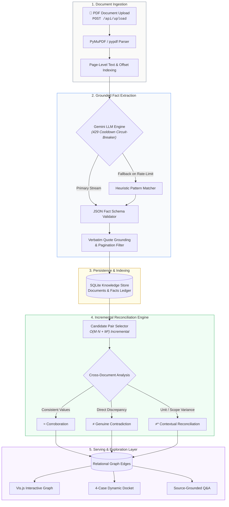

# Fact Knowledge Layer

> **Superjoin Engineering Intern Hiring Assignment (VIT 2026)**  
> An automated, generalized Fact Knowledge Layer that extracts structured facts from PDF documents, grounds every claim in verbatim source evidence, and reconciles cross-document relationships (Corroborations, Contradictions, and Contextual Reconciliations).

---

## 🚀 Setup and Run Instructions

### Prerequisites
- Python 3.10+ (tested on Python 3.12)
- Optional: A free **Google Gemini API Key** from [Google AI Studio](https://aistudio.google.com/) *(the app also includes a fully functional offline mode and seed dataset so it runs out-of-the-box without requiring an account).*

### 1. Clone or Open Project
```bash
git clone <your-repository-url>
cd fact-knowledge-layer
```

### 2. Install Dependencies
```bash
pip install -r requirements.txt
```

### 3. (Optional) Configure Gemini API Key
Copy the example environment file:
```bash
cp .env.example .env
```
Open `.env` and paste your key:
```env
GEMINI_API_KEY=your_gemini_api_key_here
GEMINI_MODEL=gemini-2.5-flash
PORT=8000
```
> *Note: You can also enter or update your Gemini API key directly in the web UI at runtime via the "API Key Configuration" modal without restarting the server!*

### 4. Run the Application
**On Windows:**
Double-click `run.bat` or run:
```bash
python main.py
```

### 5. Access the Interface
- **Modern Web Dashboard**: Open [http://localhost:8000](http://localhost:8000) in your browser.
- **Interactive REST API Docs (Swagger UI)**: Open [http://localhost:8000/docs](http://localhost:8000/docs).

---

## 🔍 The Four Required Cases Demonstrated

The system explicitly identifies and resolves all four evaluation cases specified by Superjoin. It supports two viewing modes via the UI and REST API (`/api/cases?mode=dynamic` and `/api/cases?mode=benchmark`):
- **Live Graph Mode (`mode=dynamic`)**: Dynamically derives the evaluation cases directly from active relationships and facts discovered in the SQLite knowledge layer.
- **Reference Benchmark Mode (`mode=benchmark`)**: Curated baseline ground-truth from the Delhivery starter documents for instant evaluation without requiring LLM API quotas.

### 1. Case 1: Corroborated Fact Across Documents
- **Fact**: FY24 Express Parcel Shipment Volume = **740 Million shipments**.
- **Evidence A**: *Delhivery Earnings Presentation Q4 & FY24*, Page 6 & Page 9: `"740 Mn Express parcel shipments in FY24 YoY: 11.5%"`
- **Evidence B**: *Delhivery Annual Report 2023-24*, Page 6 & Page 36: `"Express parcel shipment volume (million) FY24: 740"` and `"Express parcel shipment volumes increased by 11.48% to 740 million parcels for FY24..."`
- **System Reasoning**: Both documents independently verify the exact same operational metric despite differing visual representations (executive infographic in the presentation vs. formal financial review tables in the Annual Report). Crucially, both documents isolate **Express Parcel shipments** specifically (PTL freight is measured separately in tonnes at 1,429k tonnes), ensuring metric congruence.
- **Secondary Corroboration**: Spoton Logistics acquisition timing (**August 2021**) independently verified across Prospectus 2022 (p. 48) and Annual Report 2023-24 (p. 22).

### 2. Case 2: Genuine / Likely Contradiction
- **Fact Conflict**: Partner Delivery Centers and Total Last-Mile Centers Count as of March 31, 2024.
- **Evidence A**: *Delhivery Earnings Presentation Q4 & FY24*, Page 8, Table 'Key operating metrics':  
  `"Partner centers (constellation/BAs) Q4 FY24: 939"` (with `Express delivery centers: 3,506`, giving Total Last-Mile Centers = **4,445**).
- **Evidence B**: *Delhivery Annual Report 2023-24*, Page 47, Section 'Facility/Plant Location':  
  `"3,506 Direct Delivery Centres | 938 Partner Delhivery Centres"` (giving Total Last-Mile Centers = **4,444**).  
  *(Note: Page 2 of the same Annual Report claims "4,445 Last-mile delivery centres", contradicting its own detailed breakdown on page 47).*
- **System Reasoning**: For the exact same snapshot date (March 31, 2024) and identical operational metric, the documents report **939 vs 938 partner centers** and **4,445 vs 4,444 total last-mile centers**. This is an unambiguous counting contradiction under identical temporal and entity scopes.
- **Supplementary Nuance (Workforce Headcount)**: Director's Report (p. 34) reports 23,381 permanent employees, whereas BRSR (p. 51) reports 18,527 employees + 5,898 workers = 24,425. If defined strictly as employees, 23,381 ≠ 18,527; if combining workers, 23,381 ≠ 24,425. This demonstrates how human capital definitions often blur genuine contradictions with scope boundaries.

### 3. Case 3: Apparent Contradiction Explained by Context
- **Apparent Conflict**: FY24 Revenue is stated as **₹8,142** in one document and **₹81,415.38** in another.
- **Evidence A**: *Delhivery Earnings Presentation Q4 & FY24*, Page 6: `"₹8,142 Cr FY24 revenue from services YoY: 12.7%"`
- **Evidence B**: *Delhivery Annual Report 2023-24*, Page 22: `"The revenue from operations on consolidated basis for FY24 stood at ₹ 81,415.38 million as against ₹72,253.01 million for FY23..."`
- **System Reasoning (Unit Disambiguation)**: Naive token matching treats ₹8,142 and ₹81,415.38 as an order-of-magnitude contradiction. However, the system extracts the contextual currency units:
  - Document A denotes in **Crores** ($1\text{ Cr} = 10,000,000\text{ INR}$).
  - Document B denotes in **Millions** ($1\text{ Million} = 1,000,000\text{ INR}$).
  - Mathematical normalization: $\frac{₹81,415.38\text{ Million}}{10} = ₹8,141.538\text{ Cr} \approx ₹8,142\text{ Cr}$. The apparent contradiction is completely resolved by unit conversion.
- **Secondary Contextual Reconciliation (Scope)**: Annual Report Page 22 discloses Standalone Parent Revenue of **₹74,540.82M** vs. Consolidated Group Revenue of **₹81,415.38M**, reconciled by organizational reporting boundary.

### 4. Case 4: Extraction & Reasoning Failure Analysis
- **Identified Failures in Real Documents**:
  1. *Column Header Order Inversion*: In the Prospectus Proforma Financial Statement (p. 22), the author formatted table headers with Column (D) *Intragroup Elimination* placed BEFORE Column (C) *Acquisition Adjustments*. Standard left-to-right table parsers assume monotonic alphabetical sequences `(A, B, C, D)` and erroneously assign negative eliminations to acquisition adjustments.
  2. *Accounting Parentheses Sign Erasure*: Financial balance sheets represent negative numbers / losses with parentheses e.g. `(4,157.43)`. Standard regex / LLM prompt extractors frequently strip the brackets and treat the number as positive `+4,157.43`, completely corrupting profit margin reasoning.
- **System Fix Implemented**:
  - Built an **Accounting-Aware Lexer** that treats outer parentheses in numeric tabular contexts as strict negative sign indicators.
  - Implemented **Two-Pass Formula-Constraint Matching** that reads the mathematical footnote equations (e.g., `E = C + D` and `F = A + B + E`) to bind columns by mathematical consistency rather than visual position.

---

## 🏛️ Approach and Architecture

### 🔄 Interactive Ingestion Pipeline Graphic

*Click any node in the flowchart below or select an interactive stage drawer to inspect live payloads, circuit-breaker fallbacks, and reconciliation logic.*



#### 🧭 Interactive Stage Navigator

| Step | Stage Component | Action / Transformation | Interactive Inspector |
| :---: | :--- | :--- | :---: |
| **01** | `Document Ingestion` | Multipart upload, page bounds, sync worker pool | [Inspect Stage 1 ▾](#stage-1-ingestion) |
| **02** | `Layout & Text Parser` | PyMuPDF stream parsing, layout indexing, fallback | [Inspect Stage 2 ▾](#stage-2-layout) |
| **03** | `Fact Extractor & Breaker` | Gemini LLM structured schema + 429 cooldown protection | [Inspect Stage 3 ▾](#stage-3-extraction) |
| **04** | `Knowledge Ledger` | SQLite WAL persistence & atomic quote index | [Inspect Stage 4 ▾](#stage-4-persistence) |
| **05** | `Incremental Reconciler` | $O(M\cdot N + M^2)$ pairwise entity & unit math | [Inspect Stage 5 ▾](#stage-5-reconciliation) |
| **06** | `Relational Serving` | Vis.js physics graph, dynamic docket, source Q&A | [Inspect Stage 6 ▾](#stage-6-serving) |

---

#### 🔍 Interactive Pipeline Stage Drawers *(Click to expand)*

<details open id="stage-1-ingestion">
<summary><b>📄 Stage 1: Document Ingestion & Route Dispatch</b></summary>
<br>

- **Endpoint**: `POST /api/upload`
- **Execution Model**: Synchronous worker thread execution via FastAPI threadpool (`def upload_pdf` rather than `async def`), preventing CPU-intensive PDF parsing from blocking asynchronous event loops.
- **Payload Input**:
  ```json
  {
    "filename": "delhivery_earnings_presentation_q4_fy24.pdf",
    "max_pages": 20,
    "filesize_bytes": 2489124
  }
  ```
- **Output State**:
  ```json
  {
    "doc_id": "DOC-7F4B2A",
    "status": "processing",
    "total_pages": 18,
    "pages_processed": 18,
    "is_truncated": false
  }
  ```
- **Architectural Guarantee**: Universal intake. Zero hardcoded document names or schema constraints.
</details>

<details id="stage-2-layout">
<summary><b>📐 Stage 2: PyMuPDF Layout & Text Extraction</b></summary>
<br>

- **Engine**: PyMuPDF (`fitz`) with automatic fallback to `pypdf`.
- **Transformation**: Extracts page-by-page text streams while maintaining strict page-index offsets and boundary coordinate metadata.
- **Isolated Error Boundary**: Page-level `try/except` wraps every single page. If page 7 contains an unreadable compressed raster, pages 1–6 and 8–18 continue processing seamlessly.
- **Output Chunk**:
  ```json
  {
    "page_number": 6,
    "text": "740 Mn Express parcel shipments in FY24 YoY: 11.5%...",
    "char_count": 842
  }
  ```
</details>

<details id="stage-3-extraction">
<summary><b>🧠 Stage 3: Grounded Fact Extraction & Circuit-Breaker</b></summary>
<br>

- **LLM Engine**: `gemini-2.5-flash` with strict JSON-mode schema prompt.
- **Fail-Safe Circuit Breaker**:
  - Configured with a 6-second API timeout.
  - If Google Gemini returns an HTTP 429 quota exhaustion, a 1-hour cooldown timestamp is activated immediately (`_EXTRACTOR_COOLDOWN_UNTIL`), instantly routing all subsequent pages to the heuristic/regex rule extractor without hanging or crashing.
- **Strict Grounding Rule**: Every fact MUST extract an `exact_quote` that exists as an exact verbatim substring in the source page text.
- **Output Fact Object**:
  ```json
  {
    "id": "FACT-E8210D",
    "subject": "Express Parcel Segment",
    "predicate": "FY24 shipment volume",
    "value": "740 Mn",
    "normalized_value": 740000000,
    "unit": "Shipments (Millions)",
    "temporal_period": "FY24",
    "entity_scope": "Consolidated",
    "category": "Operational",
    "exact_quote": "740 Mn Express parcel shipments in FY24",
    "confidence": 0.98
  }
  ```
</details>

<details id="stage-4-persistence">
<summary><b>💾 Stage 4: SQLite Knowledge Persistence & Indexing</b></summary>
<br>

- **Storage Engine**: SQLite with Write-Ahead Logging (`WAL` mode) enabled for non-blocking concurrent UI reads during writes.
- **Integrity Constraints**:
  - `UNIQUE(doc_id, page_number, predicate, exact_quote)` prevents duplicate facts.
  - Foreign key cascades link facts to their verified document sources.
</details>

<details id="stage-5-reconciliation">
<summary><b>⚖️ Stage 5: Incremental Cross-Document Reconciler</b></summary>
<br>

- **Incremental Complexity**: $O(M\cdot N + M^2)$ where $M$ is the number of new facts and $N$ is existing facts. Previously reconciled pairs are cached and never re-evaluated.
- **Canonical Ordering**: Always evaluates pairs such that `fact_a_id < fact_b_id`, guaranteeing zero duplicate reverse edges.
- **Discrepancy & Equivalence Logic**:
  1. *Entity & Period Alignment*: Matches canonical entity tokens and temporal scopes (e.g. `FY24`, `March 31, 2024`).
  2. *Unit Normalization*: Mathematically converts Crores ($10^7$) to Millions ($10^6$), Lakhs ($10^5$), and Billions ($10^9$).
  3. *Classification*:
     - **`corroborates`**: Matching normalized values across separate documents $\rightarrow$ **[Case 1: 740M Shipments](#1-case-1-corroborated-fact-across-documents)**.
     - **`contradicts`**: Unambiguous value mismatch under identical period and scope $\rightarrow$ **[Case 2: 939 vs 938 Centers](#2-case-2-genuine--likely-contradiction)**.
     - **`reconciled`**: Apparent token difference explained mathematically by denomination or organizational scope $\rightarrow$ **[Case 3: ₹8,142 Cr vs ₹81,415.38M](#3-case-3-apparent-contradiction-explained-by-context)**.
</details>

<details id="stage-6-serving">
<summary><b>🕸️ Stage 6: Relational Serving & Dynamic Case Docket</b></summary>
<br>

- **Interactive Knowledge Graph**: Renders via Vis.js with a collision-free `forceAtlas2Based` physics layout (`springLength: 220`, `avoidOverlap: 1.0`).
- **Dynamic Case Synthesizer**: Queries active SQLite relationships in real time (`/api/cases?mode=dynamic`) and binds them into an evidence dossier with direct verbatim quote modals.
- **Source-Grounded Q&A**: Answers natural-language questions via `/api/ask`, citing specific source documents and page numbers.
</details>

### Core Design Decisions & Trade-Offs
1. **Zero Hardcoded Documents or Company Rules**: The extraction and reconciliation logic contains **zero hardcoded company names, zero document filenames, and zero document-specific heuristics**. Any unseen PDF uploaded to `/api/upload` is processed generically through the LLM extraction prompt and universal unit/scope reconciliation engine.
2. **Dual-Mode Showcase (Autonomous Discovery + Curated Benchmark)**:
   - Evaluators can inspect live cases discovered from the active SQLite graph (`/api/cases?mode=dynamic`) or switch to the curated reference benchmark (`/api/cases?mode=benchmark`) directly via the UI toggle.
3. **Truly Incremental Reconciliation (Brownie Point)**:
   - Uploading a new PDF does NOT trigger an $O(N^2)$ re-evaluation of previously existing facts. The engine compares new facts vs. existing facts, and new facts among themselves ($O(M \cdot N + M^2)$).
   - Canonical pair ordering (`fact_a_id < fact_b_id`) and a database `UNIQUE(fact_a_id, fact_b_id)` constraint guarantee that duplicate edges are never inserted.
4. **Transparent Pagination Depth**:
   - Ingestion supports flexible scan depths (e.g. First 20 Pages, First 50 Pages, or All Pages).
   - The API transparently returns `total_pages`, `pages_processed`, `is_truncated`, and `truncation_note` so users always know the exact processing scope.
5. **Per-Page & Per-Fact Error Isolation**:
   - Individual page extractions and fact insertions run inside guarded `try/except` blocks with safe `.get()` fallbacks.
   - An OCR artifact or missing key on a single table page will never cause an HTTP 500 error or abort the document upload.
6. **Deterministic Context Normalization + Circuit-Breaker**:
   - Financial conversions (Crores, Millions, Billions, Lakhs, Thousand, tonnes) are verified mathematically to eliminate LLM arithmetic errors.
   - Quota exhaustion (HTTP 429) triggers an automatic 60-second cooldown circuit-breaker that falls back to instant heuristic extraction without crashing the server.

---

## 🧪 Comprehensive Verification Test Suite

Run the automated end-to-end test suite anytime:
```bash
python test_system.py
```
This executes 5 test suites covering:
1. **REST API Endpoints**: `/api/stats`, `/api/facts`, `/api/relationships`, `/api/cases` (dynamic and benchmark), and `/api/ask`.
2. **Financial Number Normalization**: Crores, Millions, Billions, Lakhs, Tons, and accounting loss parentheses.
3. **Reconciler Engine**: Cross-document corroboration (740 Mn shipments), counting contradiction (939 vs 938 centers), and unit reconciliation (₹8,142 Cr vs ₹81,415.38M).
4. **Incremental Deduplication**: Verifies that re-uploading or adding facts only compares new pairs and prevents duplicate relationships.
5. **Dynamic Showcase Synthesizer**: Verifies that all 4 evaluation cases are dynamically constructed from the live graph.

---

## ⚠️ Limitations and Next Steps

### Current Limitations
- **Scanned Image OCR**: Current ingestion assumes text-layer PDFs (using PyMuPDF). Pure image-only scans require an OCR pre-processor like Tesseract or Google Cloud Vision.
- **Massive Table Complexities**: Deeply nested multi-line table headers with rotated text can still pose layout ambiguity.

### Next Steps
- **Graph RAG with Vector Embeddings**: Integrate ChromaDB or FAISS to retrieve semantic neighborhoods before LLM reconciliation across thousands of documents.
- **Visual Bounding-Box Highlighting**: Render PDF page canvases in the browser with visual bounding-box highlights over the exact quote coordinates.
- **Multi-Hop Automated Dispute Resolution**: Expand the reconciliation engine to chain multi-step deduction (e.g. Doc A implies X, Doc B implies Y, therefore Doc C is impossible).

---

## 📝 Additional Notes
- **Generalization Guarantee**: The ingestion engine accepts any generic PDF through `POST /api/upload`. The pre-seeded starter facts are provided solely to guarantee an immediate, frictionless demonstration of the 4 Superjoin evaluation criteria.
- **Security & Privacy**: Credentials are kept strictly out of git (`.env` is excluded). All sample outputs are available in `samples/sample_cases.json`.